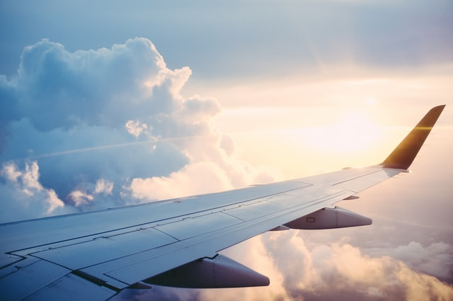

# Sheila Amalia Burhanudin
*An Aspiring Data Scientist

# Education
* Data Engineer Bootcamp, *Shift Academy*, June 2021-present
* Data Science Bootcamp (Machine Learning Specialization), *Rakamin Academy*, Nov 2020-Feb 2021
* Bachelors of Engineering (Geodetic Engineering), *Universitas Gadjah Mada*, 2012-2016

# [Project 1: Flight Delay Prediction](https://github.com/sheilaamalia/Machine-Learning-Projects/blob/master/1.%20Flight%20Delay%20Prediction/Final_Flight%20Delay%20Prediction.ipynb)

Photo by <a href="https://unsplash.com/@rparmly?utm_source=unsplash&utm_medium=referral&utm_content=creditCopyText">Ross Parmly</a> on <a href="https://unsplash.com/s/photos/flight?utm_source=unsplash&utm_medium=referral&utm_content=creditCopyText">Unsplash</a>

This project performing supervised learning to predict delay for American Airlines.
* **Python libraries used:** Scikit learn, Seaborn, Pandas, Matplotlib
* **Input:** Tweets, News
* **Output:** Sentiment of Cryptocurrency

